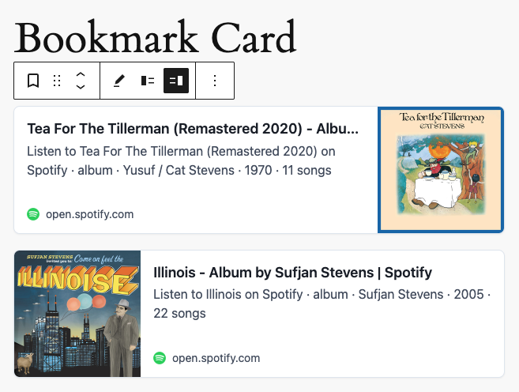

# Bookmark Card

Turn any URL into a beautiful link preview card with title, description, and image, just like sharing on social media.

Bookmark Card turns any external URL into a rich link preview card showing the page title, description, and thumbnail image, just like links shared on Facebook or Twitter. Add it as a block, paste a link, and get an embed-style preview card automatically.

Choose between default (vertical) and horizontal card styles, customize border radius, control media position, and open links in a new tab.

## Screenshots

